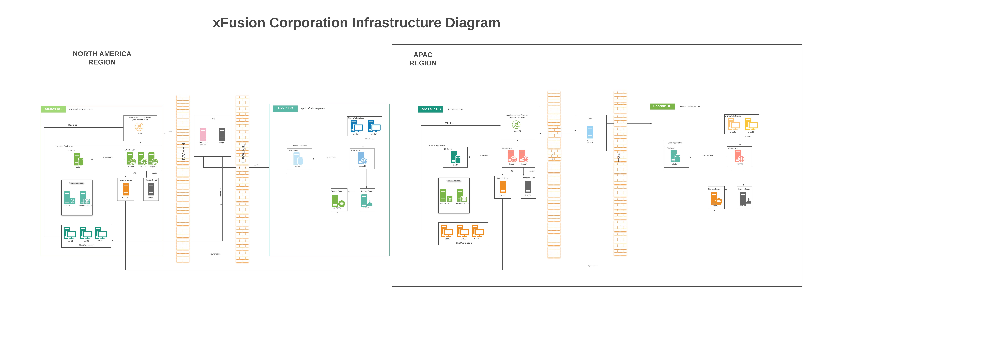

# KodeKloud Engineer Tasks  
This repository contains the solutions to all the assigned tasks completed by me as an Engineer at Nautilus, xFusion Corp - a KodeKloud platform for IT Professionals to gain real hands-on experience working on trending IT technologies. 

## Overview:  
Project Nautilus is the Naval subdivision of the xFusionCorp Industries. Nautilus Application helps the Naval forces to make smart procurement decisions of their manned or unmanned maritime systems while ensuring that the operational requirements are met. It also aims to provide the best-in-class operational support, improving the safety and life extension of existing machines and reducing the cost of ownership.

## Infrastructure Diagram
